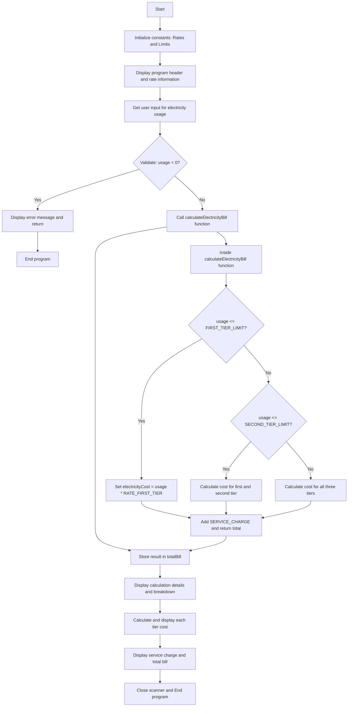

# Electricity Bill Calculator Flowchart

## Flowchart Diagram

## Description

The flowchart illustrates the flow of the Electricity Bill Calculator program:

1. **Initialization**: The program starts by defining constants for the electricity rates and tier limits
2. **User Interaction**: Displays the rate information and prompts the user for electricity usage
3. **Validation**: Checks if the input is valid (non-negative)
4. **Calculation**: Calls the calculation function which determines the cost based on the tiered pricing structure
5. **Output**: Displays a detailed breakdown of the charges and the total bill

The calculation logic follows a tiered approach:
- If usage is ≤ 150 units: Apply first tier rate to all units
- If usage is ≤ 400 units: Apply first tier rate to first 150 units, then second tier rate to remaining units
- If usage is > 400 units: Apply first tier rate to first 150 units, second tier rate to next 250 units, and third tier rate to remaining units
- Finally, add the fixed service charge to get the total bill